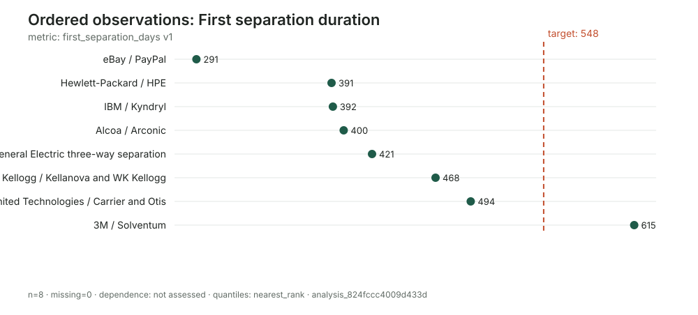
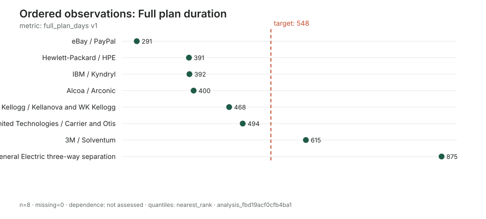
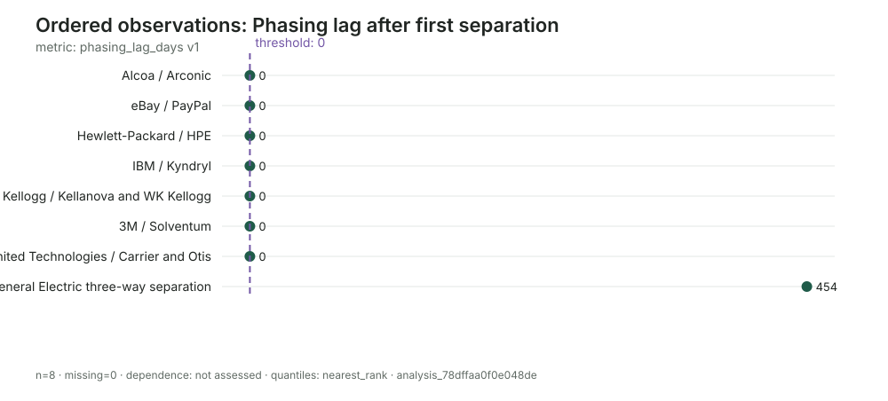

# How long do corporate separations take?

## An auditable Wikipedia-based reference-class analysis

## Executive decision brief

When a public company announces a spin-off or breakup, management usually
offers a target year or quarter. That schedule is an inside view: it reflects
the intended legal, tax, operational, and reporting work. A decision-maker
also needs an outside view—how long comparable announced separations actually
took, including plans that changed after announcement.

This pilot examines eight large US public-company separation plans announced
from 2014 through 2022. Cases were selected using announcement-era facts, not
their later duration or apparent success. Wikipedia company histories provide
the registered evidence for company identity and chronology. The analysis
distinguishes the first independent-company milestone from completion of the
entire plan, because a phased breakup can satisfy the first while leaving
substantial execution risk.

The practical findings are:

- The median time to the **first separation** was **410.5 days**, or about 13.5
  months. The observed range was 291–615 days.
- The median time to **full-plan completion** was **434 days**, or about 14.3
  months. The range was 291–875 days.
- Only **1 of 8** plans reached either endpoint within 12 months.
- An 18-month allowance covered **7 of 8** first separations but only **6 of 8**
  full plans.
- A 24-month allowance covered every first separation and **7 of 8** full
  plans.
- GE reached its first separation after 421 days, close to the cohort center,
  but required 875 days to finish its phased three-company plan.

The decision implication is not that every separation needs 24 or 30 months.
It is that schedule confidence should depend on the endpoint and plan
structure. For a conventional one-stage separation, roughly 14–18 months is a
reasonable provisional planning range. For a genuinely phased breakup, a
decision-maker should separately budget the time and exposure between the
first milestone and final completion.

## What decision this analysis informs

The analysis is designed for a board member, executive, investor, employee, or
counterparty evaluating a newly announced public-company separation. Such a
decision-maker may need to plan:

- standalone operating readiness and transitional-service agreements;
- financing, tax rulings, regulatory approvals, and capital allocation;
- leadership and employee-retention periods;
- investor guidance and the timing of segment revaluation; and
- exposure that persists after the first spun-off company starts trading.

The primary question is: **How much calendar time should be allowed from public
announcement to first independence and to completion of the full plan?**

This is a descriptive timing analysis. It does not estimate whether separation
creates shareholder value, whether a particular plan will complete, or the
causal effect of plan complexity. Those require different outcomes and a much
larger, independently enumerated cohort.

## Reference-class construction

The unit of analysis is one parent-company separation plan, not one successor
company. A plan enters the seed cohort if it was publicly announced from 2014
through 2022 by a large publicly traded US parent and was intended to create at
least one separately traded public company through a split or spin-off.

Membership is frozen using facts available at announcement. Later completion,
delay, revision, partial completion, or abandonment cannot determine whether a
case belongs. This prevents the common error of studying only separations that
eventually completed neatly.

The eight cases are eBay/PayPal, Hewlett-Packard/HPE, Alcoa/Arconic, United
Technologies/Carrier and Otis, IBM/Kyndryl, General Electric's three-way
separation, Kellogg/Kellanova and WK Kellogg, and 3M/Solventum.

This is a documented seed cohort, not a certified census. It spans industries
and years and is suitable for testing an auditable workflow and forming a
provisional outside view. Its frequencies should not be presented as population
probabilities until an independent source is used to enumerate all qualifying
announcements.

## Why two completion endpoints matter

“Completed” is underspecified for a multi-company plan. This analysis therefore
uses two versioned metrics:

1. **First separation days:** announcement to the first planned business
   becoming legally separate or beginning regular-way public trading.
2. **Full plan days:** announcement until all separations in the latest
   documented version of the plan are complete.

For seven cases the supported first and full dates coincide. Their phasing lag
is a valid zero because both endpoint events exist and share the same sourced
date. A missing or malformed endpoint would remain missing and would never be
turned into zero.

GE is materially different. Its [November 2021 announcement](https://en.wikipedia.org/wiki/General_Electric)
envisioned GE HealthCare, GE Vernova, and GE Aerospace. GE HealthCare became
independent on January 4, 2023, while GE Vernova followed on April 2, 2024. The
454 days between those milestones are real post-first-separation exposure.

Kellogg illustrates another distinction. Its
[June 2022 plan](https://en.wikipedia.org/wiki/Kellogg%27s) initially described
three businesses; the plant-based spin-off was shelved in January 2023, and the
remaining split completed in October. The revision is retained as an event.
The original plan is not silently rewritten with hindsight.

## Case chronology

| Parent plan | Announced | First separation | Full plan | First days | Full days | Structural note |
|---|---:|---:|---:|---:|---:|---|
| [eBay / PayPal](https://en.wikipedia.org/wiki/EBay) | 2014-09-30 | 2015-07-18 | 2015-07-18 | 291 | 291 | One spin-off |
| [Hewlett-Packard / HPE](https://en.wikipedia.org/wiki/Hewlett-Packard) | 2014-10-06 | 2015-11-01 | 2015-11-01 | 391 | 391 | Two-company split |
| [IBM / Kyndryl](https://en.wikipedia.org/wiki/Kyndryl) | 2020-10-08 | 2021-11-04 | 2021-11-04 | 392 | 392 | One spin-off |
| [Alcoa / Arconic](https://en.wikipedia.org/wiki/Alcoa) | 2015-09-28 | 2016-11-01 | 2016-11-01 | 400 | 400 | Two-company split |
| [General Electric](https://en.wikipedia.org/wiki/General_Electric) | 2021-11-09 | 2023-01-04 | 2024-04-02 | 421 | 875 | Phased three-company plan |
| [Kellogg](https://en.wikipedia.org/wiki/Kellogg%27s) | 2022-06-21 | 2023-10-02 | 2023-10-02 | 468 | 468 | Plan revised before split |
| [United Technologies](https://en.wikipedia.org/wiki/United_Technologies) | 2018-11-26 | 2020-04-03 | 2020-04-03 | 494 | 494 | Two simultaneous spin-offs plus merger |
| [3M / Solventum](https://en.wikipedia.org/wiki/Solventum) | 2022-07-26 | 2024-04-01 | 2024-04-01 | 615 | 615 | One spin-off |

The first-separation distribution is comparatively compact. Six of eight cases
fall between 391 and 494 days. PayPal is faster at 291 days, while Solventum is
slower at 615. An 18-month allowance lies above seven observations but remains
inside the observed support; it is prudent relative to the center, not an
extreme worst case.

The full-plan view changes only one case, but that one case changes the upper
tail substantially. This is exactly why the endpoint must be declared before
analysis. Calling GE “complete” at its first spin-off would understate the
execution period for the plan the company announced.

## Milestone analysis

The table converts the distributions into schedule-attainment frequencies.
Months are represented by explicit calendar-day approximations used by the
audited threshold commands: 365, 456, 548, 730, and 913 days.

| Planning allowance | First separation reached | Full plan completed |
|---|---:|---:|
| 12 months | 1/8 (12.5%) | 1/8 (12.5%) |
| 15 months | 5/8 (62.5%) | 4/8 (50.0%) |
| 18 months | 7/8 (87.5%) | 6/8 (75.0%) |
| 24 months | 8/8 (100%) | 7/8 (87.5%) |
| 30 months | 8/8 (100%) | 8/8 (100%) |

Three planning regimes emerge:

- **Twelve months is aggressive.** PayPal is the only case inside it.
- **Fifteen to eighteen months is the central operating range.** Most first
  separations occur here, but 18 months still misses Solventum and the full GE
  plan.
- **Twenty-four to thirty months is a tail allowance.** Twenty-four months
  covers all first milestones; 30 months covers the full observed support.

These are empirical frequencies with denominator eight, not smooth forecasts.
Each case changes a reported proportion by 12.5 percentage points.

## Phasing and plan-structure risk

Seven plans have a zero-day phasing lag under the declared event convention.
GE has 454 days. The distribution should not be summarized by its 56.8-day
mean and applied indiscriminately: that would invent a modest lag for every
case when the observed pattern is instead a structural split between same-day
completion and a genuinely phased plan.

The useful decision rule is categorical. Ask at announcement whether the plan
contains multiple serial separation milestones. If it does, maintain separate
readiness dates, budgets, and risk registers for first independence and full
completion. If it does not, the two dates may coincide—but that should be an
explicit plan fact, not an assumed default.

Kellogg's revision adds a second type of structural exposure. The final plan
completed in 468 days, but the destination changed along the way. A schedule
metric alone cannot express scope stability. A future larger study should pair
duration with a plan-change outcome such as unchanged, revised, partially
executed, abandoned, or superseded.

## Sensitivity and robustness

With only eight cases, false precision is a larger danger than sampling-error
machinery. Several transparent checks are more informative:

- The leave-one-case-out median for first separation ranges from **400 to 421
  days**. The central timing result is not driven by PayPal or Solventum.
- The leave-one-case-out median for full-plan completion ranges from **400 to
  468 days**. The center remains near 13–15 months even when any one case is
  removed.
- Excluding GE reduces mean full-plan duration from **490.8 to 435.9 days**.
  This shows upper-tail sensitivity, but GE remains in the primary analysis
  because it satisfies the predeclared cohort rule.
- The conventional even-sample medians are 410.5 and 434 days. Flyvbjerg's
  reported nearest-rank P50 values are 400 days for each distribution. Both are
  retained because they answer slightly different summary conventions.
- No cross-case dependence clusters are currently declared. The analysis unit
  is the parent plan, preventing the multiple successors within GE or United
  Technologies from being falsely counted as independent cases. Broader common
  shocks or advisor/regulatory clusters remain unassessed.

The package's cluster-sensitivity command correctly returns no result rather
than pretending undeclared clusters exist. For this pilot, the manually
auditable leave-one-case-out ranges above are the relevant influence check.

## How a decision-maker should use the data

A new separation should first be mapped to a specific endpoint and planning
structure.

For a one-stage spin-off, use approximately **14 months as the historical
center**, **18 months as a prudent operating allowance**, and **24 months as an
observed-tail allowance** in this pilot. Do not convert 7/8 into a precise 87.5%
forecast for the new case; the cohort is too small and not exhaustive.

For a phased multi-company breakup, use two clocks. The first-separation clock
can still start from the broad reference class. The final-completion clock
needs an additional phase allowance informed by the number and sequence of
separations. The one phased case here demonstrates a 454-day additional lag,
but one observation is a scenario, not an estimable distribution.

Before adjusting the outside view, document target-specific facts that could
justify movement:

- number and sequencing of planned successor companies;
- tax ruling and regulatory dependencies;
- geographic and legal-entity complexity;
- transitional-service and standalone-system requirements;
- whether a merger, sale, or financing is coupled to the separation;
- management's exact definition of “complete”; and
- whether the announced scope has already changed.

The final decision record should show the outside-view baseline, each explicit
adjustment, and the evidence for the adjustment. That makes disagreement about
the schedule inspectable rather than rhetorical.

## Evidence quality and auditability

Wikipedia is used here as best-available tertiary evidence for identity,
chronology, and descriptive company history. The registered pages often cite
company announcements, SEC filings, and contemporaneous reporting. For this
pilot, exact page identities and retrieval times are stored; event records link
each date to its source identity.

Wikipedia is not treated as proof of absence. If a page lacked a completion
date, that endpoint would remain missing in intake or coverage. No missing,
malformed, or unsupported result is coded as zero or as failure. Stronger
primary evidence would be appropriate where dates conflict, legal effective
time matters, or the analysis will support a high-stakes transaction.

The audit trail contains:

- one versioned target and a written cohort definition;
- eight registered source identities and eight parent-plan cases;
- announcement, first-completion, full-completion, and revision events;
- three versioned metrics with explicit endpoint and zero policies;
- candidate observations followed by explicit acceptance decisions;
- coverage states for every case-metric pair;
- locked analyses, distributions, threshold results, and plot receipts; and
- deterministic SVG charts generated from accepted analysis records.

No EDSL Job was needed, constructed, or executed. No paid model call was made.

## Limitations and next evidence step

The main limitation is cohort discovery, not arithmetic. A complete set of
eight measured cases can still be a selected set of all eligible cases. Before
using the results as a formal base rate, construct an independent announcement
census from a fixed list or database and audit inclusions and exclusions.

Other limitations are the small denominator, broad industry mix, endpoint
conventions that may differ by a day from legal distributions, and insufficient
cases to estimate conditional effects of plan complexity. The 2014–2022 window
also spans changing capital-market and regulatory conditions.

The most valuable next expansion is not simply more famous examples. It is an
outcome-independent enumeration of eligible separation announcements, followed
by predeclared coding of plan structure and plan revisions. That would support
stratified reference classes without turning interesting histories into
post-hoc explanations.

## Reproduction note

The authoritative records are under `.flyvbjerg/`. The target, cohort rule, and
metric specifications are also available as readable files beside this report.
At report generation, `flyvbjerg validate` accepted all workspace JSON records,
and the package test suite passed. `flyvbjerg next` reported no unresolved
intake, although its generic recommendation remained to register evidence.
