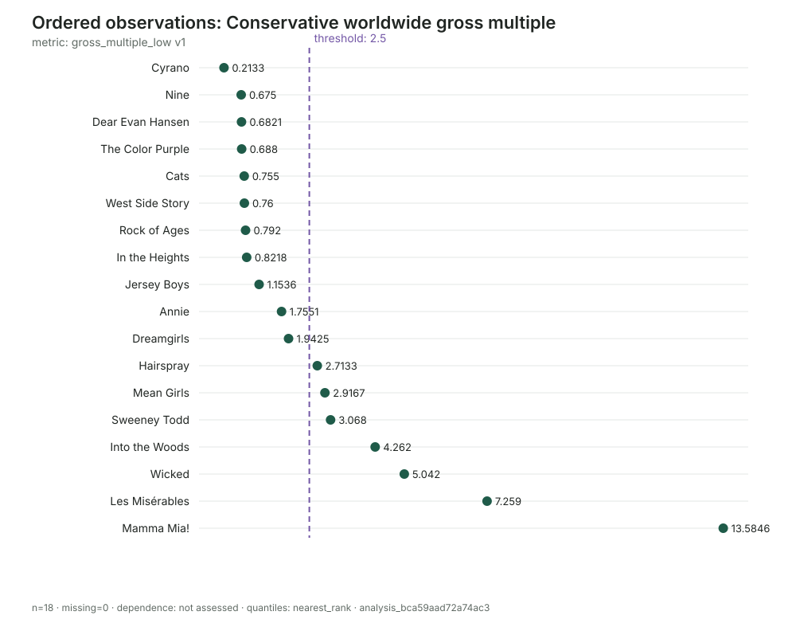
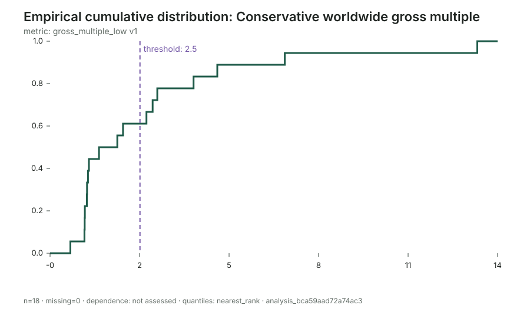

# Theatrical film adaptations of stage musicals

This pilot evaluates the theatrical economics of 18 English-language film
adaptations of stage musicals released in the United States from 2006–2024.
The cohort was fixed from provenance and release facts before collecting
financial outcomes, so membership does not depend on success or failure.

## Rebuild the audit workspace

`cohort.json` is the canonical checked-in research fixture. It contains 20
membership candidates: 18 inclusions and two exclusions with explicit reasons.
Excluded candidates have no financial outcome fields. Rebuild the ignored
Flyvbjerg workspace in any empty directory with:

```bash
python rebuild.py /tmp/theatrical-musicals-audit
```

The runner uses Flyvbjerg's public CLI, calls `flyvbjerg next` after every
material stage, performs no browsing, and never constructs or executes an EDSL
Job. It finishes by validating the reconstructed ledger and printing its case,
observation, distribution, and budget-bound sensitivity summary. It also
creates an immutable comparison between the conservative and optimistic
analyses, evaluates the 2.0x and 2.5x thresholds, and writes a comparison plot
with a JSON receipt.

## The central caution

Worldwide box-office gross divided by production budget is observable and
comparable, but it is **not accounting profit**. Gross includes money retained
by cinemas; production budget generally excludes marketing and distribution;
and the calculation omits streaming, television, home entertainment, music,
participations, and other ancillary economics.

The report therefore uses three zones:

- **Below production budget:** gross multiple below 1.0x.
- **Economically indeterminate:** 1.0x to below 2.5x.
- **Strong theatrical-recovery proxy:** at least 2.5x.

The 2.5x line is a scenario convention, not a universal break-even rule.

## Case results

| Film | Year | Budget, $m | Worldwide gross, $m | Gross multiple |
|---|---:|---:|---:|---:|
| Cyrano | 2022 | 30 | 6.4 | 0.21x |
| Nine | 2009 | 80 | 54.0 | 0.68x |
| Dear Evan Hansen | 2021 | 27–28 | 19.1 | 0.68–0.71x |
| The Color Purple | 2023 | 90–100 | 68.8 | 0.69–0.76x |
| Cats | 2019 | 80–100 | 75.5 | 0.76–0.94x |
| West Side Story | 2021 | 100 | 76.0 | 0.76x |
| Rock of Ages | 2012 | 75 | 59.4 | 0.79x |
| In the Heights | 2021 | 55 | 45.2 | 0.82x |
| Jersey Boys | 2014 | 40–58.6 | 67.6 | 1.15–1.69x |
| Annie | 2014 | 65–78 | 136.9 | 1.76–2.11x |
| Dreamgirls | 2006 | 75–80 | 155.4 | 1.94–2.07x |
| Hairspray | 2007 | 75 | 203.5 | 2.71x |
| Mean Girls | 2024 | 36 | 105.0 | 2.92x |
| Sweeney Todd | 2007 | 50 | 153.4 | 3.07x |
| Into the Woods | 2014 | 50 | 213.1 | 4.26x |
| Wicked | 2024 | 150 | 756.3 | 5.04x |
| Les Misérables | 2012 | 61 | 442.8 | 7.26x |
| Mamma Mia! | 2008 | 52 | 706.4 | 13.58x |

Budget ranges are preserved. The lower multiple divides gross by the high
budget estimate; the upper multiple divides by the low estimate.

## Outside-view findings

- **8/18 (44%)** grossed less worldwide than their reported production-budget
  range. This is a robust downside finding under both budget bounds.
- **3/18 (17%)** fall between 1.0x and 2.5x: Jersey Boys, Annie, and
  Dreamgirls. Gross and production budget alone cannot establish whether these
  films were profitable.
- **7/18 (39%)** reached at least 2.5x under both budget bounds: Hairspray,
  Sweeney Todd, Mamma Mia!, Les Misérables, Into the Woods, Mean Girls, and
  Wicked.
- At a looser 2.0x threshold, the count ranges from **7/18 to 9/18**, because
  Dreamgirls and Annie cross the line only under their lower budget estimates.
- The conservative median multiple is **1.45x**; the conventional optimistic
  median is **1.88x**. Both lie in the indeterminate zone.
- The conservative mean is **2.73x**, but it is distorted by Mamma Mia!'s
  13.58x result. A new film should not use the mean as its typical-case forecast.





## Time-context sensitivity

The 11 releases through 2019 contain three films below 1.0x, three in the
indeterminate zone, and five at or above 2.5x. Among the seven 2021–2024 films,
five are below 1.0x and two—Mean Girls and Wicked—are above 2.5x.

This contrast is descriptive, not a time trend or causal pandemic estimate.
The 2021 films faced unusual theatrical and streaming conditions, the seed
cohort is not exhaustive, and the later group mixes extreme successes with
extreme shortfalls. It does show why a decision-maker should model release
strategy and market regime explicitly rather than pool every historical film
without context.

## Decision use

For a proposed adaptation, the defensible baseline is a skewed distribution,
not a single expected multiple:

- downside scenario: theatrical gross below production cost;
- central scenario: roughly 1.5–1.9x production cost, still not demonstrably
  profitable after marketing and exhibitor shares;
- strong scenario: 2.5x or more; and
- breakout scenario: 5x or more, observed in Wicked, Les Misérables, and Mamma
  Mia! in this seed cohort.

A greenlight model should replace the proxy with a film-specific waterfall:
domestic and international rentals, marketing, distribution fees, residuals
and participations, financing cost, and ancillary revenues. The historical
gross-multiple distribution can then drive scenarios through that model.

## Audit status

All 18 Wikipedia source identities, 18 film cases, 90 financial observations,
acceptance decisions, metric definitions, coverage states, analyses, and plot
receipts are stored under `.flyvbjerg/`. No EDSL Job was constructed or run and
no paid model call was used. See [definition.md](definition.md) for the cohort
and measurement rules and [friction-log.md](friction-log.md) for package
limitations exposed by the exercise.
