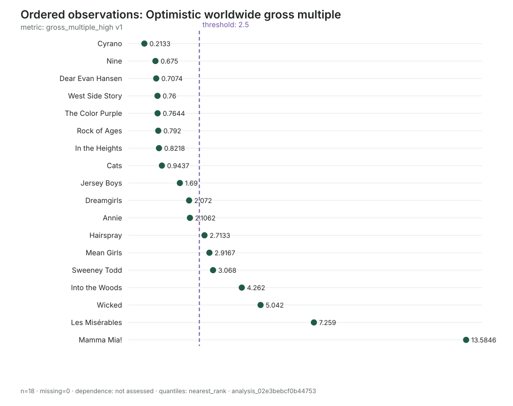

# Do theatrical adaptations of stage musicals make money?

## An auditable reference-class analysis of 18 films released from 2006–2024

## Executive decision brief

Adapting a successful stage musical for the screen can look unusually safe.
The underlying title has already attracted audiences, the score is proven, and
the property may arrive with recognizable stars, awards, or decades of cultural
familiarity. The historical results in this pilot show a less comfortable
outside view: theatrical outcomes are strongly polarized, and a few enormous
hits make the category average look much safer than the typical film.

This analysis covers 18 English-language film adaptations of previously
produced stage musicals, released theatrically in the United States between
2006 and 2024. Membership was determined from creative provenance and release
facts before budget and box-office outcomes were collected. Films therefore do
not enter the cohort because they succeeded, failed, or became famous for doing
either.

The principal result is a worldwide theatrical gross multiple: worldwide box
office divided by reported production budget. Budget ranges are preserved, so
each ranged case has a conservative and optimistic multiple.

The headline findings are:

- **8 of 18 films (44%)** grossed less worldwide than their reported production
  budgets.
- **3 of 18 (17%)** grossed between 1.0x and 2.5x budget, an economically
  indeterminate zone without a full revenue-and-cost waterfall.
- **7 of 18 (39%)** exceeded a 2.5x strong theatrical-recovery proxy under both
  ends of their budget estimates.
- The conventional conservative median was **1.45x**; the optimistic median
  was **1.88x**. Neither is enough to establish net profitability.
- The conservative mean was **2.73x**, but that figure is pulled upward by
  *Mamma Mia!* at 13.58x. It is not a sensible typical-film forecast.

The decision implication is that a producer should not underwrite a new
adaptation to the category mean. The historical distribution is closer to a
barbell: substantial probability of failing even to match production cost at
the worldwide box office, alongside a smaller set of titles producing very
large multiples.

## What “profitability” means here

Worldwide gross is not money returned to the studio. Cinemas retain part of
ticket sales, and the studio's share differs by market and contract. Reported
production budgets commonly exclude prints and advertising, distribution
costs, financing, residuals, overhead, and talent participations. Conversely,
the theatrical calculation omits streaming, premium video-on-demand,
television, home entertainment, soundtrack, licensing, and other ancillary
revenue.

Accordingly, this report does **not** label a film profitable merely because
gross exceeded budget. It uses three deliberately modest categories:

1. **Below production budget — under 1.0x.** Worldwide box office did not even
   match reported production cost. That is a strong theatrical downside signal,
   though it is still not a complete lifetime loss calculation.
2. **Indeterminate — 1.0x to under 2.5x.** The film generated meaningful gross,
   but the available common fields cannot establish whether all costs were
   recovered.
3. **Strong theatrical-recovery proxy — at least 2.5x.** The film produced a
   substantial box-office multiple. This is favorable evidence, not audited
   accounting profit.

The 2.5x threshold is a planning convention rather than a universal industry
law. The analysis therefore also tests a looser 2.0x line. Reported budget
ranges change two films' status at 2.0x, but they do not change any film's
classification at 1.0x or 2.5x.

## The reference class

The inclusion rule requires an English-language feature film directly adapted
from a previously produced stage musical, with a US theatrical release from
2006 through 2025 by an established theatrical distributor. Sequels not
directly adapting the stage work, original screen musicals, animated films,
concert films, television films, and streaming-first releases are excluded.

This gives a common decision type: whether to finance and theatrically release
a screen adaptation of a stage property. It intentionally excludes successful
original screen musicals such as *La La Land* and *The Greatest Showman* because
their development risk and source-property economics differ. It also excludes
*Mamma Mia! Here We Go Again*: it inherits the film and stage franchise but is
not a direct adaptation of the original stage book.

The result is a documented seed cohort, not a proven census of every eligible
film. Before the observed shares are used as formal population probabilities,
the cohort should be audited against an independent, fixed enumeration.

## Film-level results

| Film | Release | Production budget | Worldwide gross | Gross multiple | Proxy zone |
|---|---:|---:|---:|---:|---|
| [Cyrano](https://en.wikipedia.org/wiki/Cyrano_(film)) | 2022 | $30m | $6.4m | 0.21x | Below budget |
| [Nine](https://en.wikipedia.org/wiki/Nine_(2009_live-action_film)) | 2009 | $80m | $54.0m | 0.68x | Below budget |
| [Dear Evan Hansen](https://en.wikipedia.org/wiki/Dear_Evan_Hansen_(film)) | 2021 | $27–28m | $19.1m | 0.68–0.71x | Below budget |
| [The Color Purple](https://en.wikipedia.org/wiki/The_Color_Purple_(2023_film)) | 2023 | $90–100m | $68.8m | 0.69–0.76x | Below budget |
| [Cats](https://en.wikipedia.org/wiki/Cats_(2019_film)) | 2019 | $80–100m | $75.5m | 0.76–0.94x | Below budget |
| [West Side Story](https://en.wikipedia.org/wiki/West_Side_Story_(2021_film)) | 2021 | $100m | $76.0m | 0.76x | Below budget |
| [Rock of Ages](https://en.wikipedia.org/wiki/Rock_of_Ages_(2012_film)) | 2012 | $75m | $59.4m | 0.79x | Below budget |
| [In the Heights](https://en.wikipedia.org/wiki/In_the_Heights_(film)) | 2021 | $55m | $45.2m | 0.82x | Below budget |
| [Jersey Boys](https://en.wikipedia.org/wiki/Jersey_Boys_(film)) | 2014 | $40–58.6m | $67.6m | 1.15–1.69x | Indeterminate |
| [Annie](https://en.wikipedia.org/wiki/Annie_(2014_film)) | 2014 | $65–78m | $136.9m | 1.76–2.11x | Indeterminate |
| [Dreamgirls](https://en.wikipedia.org/wiki/Dreamgirls_(film)) | 2006 | $75–80m | $155.4m | 1.94–2.07x | Indeterminate |
| [Hairspray](https://en.wikipedia.org/wiki/Hairspray_(2007_film)) | 2007 | $75m | $203.5m | 2.71x | Strong proxy |
| [Mean Girls](https://en.wikipedia.org/wiki/Mean_Girls_(2024_film)) | 2024 | $36m | $105.0m | 2.92x | Strong proxy |
| [Sweeney Todd](https://en.wikipedia.org/wiki/Sweeney_Todd%3A_The_Demon_Barber_of_Fleet_Street_(2007_film)) | 2007 | $50m | $153.4m | 3.07x | Strong proxy |
| [Into the Woods](https://en.wikipedia.org/wiki/Into_the_Woods_(film)) | 2014 | $50m | $213.1m | 4.26x | Strong proxy |
| [Wicked](https://en.wikipedia.org/wiki/Wicked_(2024_film)) | 2024 | $150m | $756.3m | 5.04x | Strong proxy |
| [Les Misérables](https://en.wikipedia.org/wiki/Les_Mis%C3%A9rables_(2012_film)) | 2012 | $61m | $442.8m | 7.26x | Strong proxy |
| [Mamma Mia!](https://en.wikipedia.org/wiki/Mamma_Mia!_(film)) | 2008 | $52m | $706.4m | 13.58x | Strong proxy |

The table is ordered by the conservative multiple, which divides gross by the
upper budget estimate. The optimistic value divides by the lower estimate.
This avoids the false precision of replacing every range with a midpoint.

## Distribution and threshold analysis

The ordered view shows three features that a single average conceals.

First, the lower group is not clustered just below a plausible break-even line.
Eight films fall below 1.0x, and five of those are at or below 0.76x. *Cyrano*
is much lower at 0.21x. These are material theatrical shortfalls relative to
production cost.

Second, the center is thin. Only *Jersey Boys*, *Annie*, and *Dreamgirls* sit
between production-budget recovery and the 2.5x proxy. The conventional median
is the midpoint of *Jersey Boys*' conservative 1.15x and *Annie*'s 1.76x,
yielding 1.45x. Flyvbjerg's nearest-rank P50 is 1.15x; both conventions are
retained in the audit record.

Third, the upper tail is very long. *Mamma Mia!* returned 13.58 times its
reported production budget in worldwide box office. *Les Misérables* reached
7.26x, while *Wicked* reached 5.04x. Those outcomes demonstrate genuine upside,
but they should be modeled as breakout scenarios rather than blended into a
typical case.

The empirical distribution places 44.4% of cases below 1.0x and 61.1% below
2.5x. Equivalently, 38.9% reach the strong-proxy zone. With only 18 films, each
case changes the frequency by 5.6 percentage points; the step function is more
honest than a smoothed curve.

## Budget-range sensitivity

Six films have ranged production budgets. Preserving those ranges answers an
important robustness question: are classifications artifacts of choosing a
favorable budget estimate?

At the main boundaries, they are not:

| Scenario boundary | Conservative budget assumption | Optimistic budget assumption |
|---|---:|---:|
| Gross below 1.0x | 8/18 (44.4%) | 8/18 (44.4%) |
| Gross at least 2.0x | 7/18 (38.9%) | 9/18 (50.0%) |
| Gross at least 2.5x | 7/18 (38.9%) | 7/18 (38.9%) |

Only the looser 2.0x threshold is sensitive. *Dreamgirls* moves from 1.94x to
2.07x, and *Annie* moves from 1.76x to 2.11x. Neither reaches 2.5x even under its
low budget estimate. All eight below-budget films remain below 1.0x under their
most favorable budget bound.

This is analytically useful: the main conclusion does not depend on midpoint
choices. Budget uncertainty matters for borderline interpretations, but it
does not erase the observed polarization.

## Release-period context

The results differ sharply across the two visible time groups in this seed
cohort:

| Release period | Below 1.0x | 1.0–2.5x | At least 2.5x | Conservative median |
|---|---:|---:|---:|---:|
| 2006–2019 | 3/11 | 3/11 | 5/11 | 1.94x |
| 2021–2024 | 5/7 | 0/7 | 2/7 | 0.76x |

This is not evidence that time itself caused weaker performance. Three of the
later releases—*In the Heights*, *Dear Evan Hansen*, and *West Side Story*—were
2021 films operating amid pandemic disruption, altered attendance patterns,
and, in some cases, simultaneous streaming. *Cyrano* followed in early 2022.
The later group also includes both *The Color Purple* below budget and the
breakout outcomes *Mean Girls* and *Wicked*.

The correct decision lesson is contextual rather than causal: release regime
belongs in the target specification. Pooling pandemic day-and-date releases
with conventional exclusive theatrical releases without showing the cluster
can obscure comparability. Conversely, deleting 2021 films after seeing their
outcomes would select on a post-hoc explanation. They remain in the primary
reference class and are shown separately as sensitivity.

## Budget exposure

The films with upper reported production budgets of at least $80 million are
*Dreamgirls*, *Nine*, *Cats*, *West Side Story*, *The Color Purple*, and
*Wicked*. Four of the six grossed less than production budget, one was
indeterminate, and one—*Wicked*—was a major success.

That pattern should not be read as a causal estimate of budget size: genre,
title, release period, creative execution, marketing, and audience scale all
co-vary. It does, however, show the financing consequence of polarization. A
large budget does not merely scale the central outcome; it increases absolute
capital at risk while the possibility of a breakout remains title-specific.

A decision-maker should therefore ask whether added production spending moves
the probability distribution or merely magnifies the same uncertain multiple.
The current data cannot answer that causally, but it can prevent the budget
from being justified by the misleading 2.73x category mean.

## What a greenlight model should do

The reference class is most useful as an input to a film-specific economic
waterfall. A serious model should include:

- domestic and international box-office scenarios;
- market-specific distributor rental rates;
- production-budget range and contingency;
- prints, advertising, publicity, and distribution overhead;
- financing costs, residuals, and talent participations;
- premium VOD, home entertainment, streaming, television, and music revenue;
- timing of cash flows; and
- downside exposure under alternative release strategies.

The historical distribution suggests at least four scenarios for such a model:

| Scenario | Historical anchor | Interpretation |
|---|---:|---|
| Severe downside | 0.2–0.8x | Gross materially below production budget |
| Central | about 1.5–1.9x | Typical by median convention; profitability unresolved |
| Strong | 2.5–5.0x | Robust theatrical recovery |
| Breakout | above 5.0x | Rare franchise-scale upside |

Scenario probabilities should not simply copy 8/18, 3/18, and 7/18 into an
investment model. The seed cohort is small and not yet exhaustive. Instead,
those shares should challenge the inside view: if a proposal assumes a 3x or
5x result as its base case, the burden is to identify pre-release evidence that
supports placing the film in the upper historical tail.

Useful target-specific adjustment factors include source-musical audience
scale, international familiarity, cast and filmmaker draw, family versus adult
positioning, release date, competitive slate, planned theatrical exclusivity,
marketing commitment, production-cost discipline, and the economics of music
rights. Each adjustment should be stated explicitly rather than folded into an
uninspectable intuition that “this title is different.”

## Evidence quality and audit trail

Wikipedia is used as best-available tertiary evidence for film identity,
stage-musical provenance, theatrical release, reported production budget, and
worldwide box office. These film pages typically cite box-office databases,
trade reporting, studio materials, and classification records. Wikipedia is
appropriate for a first-pass auditable reference class, but it is not treated
as infallible or as evidence of absence.

Every source has a registered identity and retrieval time. Budget lows and
highs are separate observations. Gross multiples remain candidates until their
inputs and calculations are inspected and explicitly accepted. Every film has
an observed coverage state for both multiple bounds. A missing budget or gross
would remain missing rather than becoming zero or a negative finding.

The Flyvbjerg workspace contains:

- one versioned decision target and a written cohort rule;
- 18 film cases and 18 registered Wikipedia source identities;
- 90 reported or calculated financial observations;
- explicit acceptance decisions for every observation;
- five versioned metric definitions;
- locked conservative and optimistic analyses;
- threshold and target-location results; and
- deterministic SVG plots with JSON receipts and analysis identifiers.

No EDSL Job was constructed or executed, and no paid model call was used.

## Limitations and next step

The principal limitation is that this is a documented seed cohort, not an
independently enumerated census. Famous successes and failures may be easier to
recall and may have richer Wikipedia pages. Complete measurement of 18 selected
films does not prove complete discovery of the eligible class.

The common metric also stops well short of true profitability. Nominal-dollar
ratios are internally coherent within each film, but comparing absolute budgets
across years would require inflation adjustment. Release strategies differ,
and the cohort is too small to estimate the independent effects of budget,
period, genre, distributor, or stage success.

The highest-value next step is a fixed enumeration audit followed by collection
of reported net profit or loss estimates where available. Those estimates
should be added as a separate metric with explicit coverage states—not inferred
for films whose pages provide only budget and gross. With a larger cohort, the
analysis could then predeclare strata for pandemic release strategy, budget
band, family orientation, jukebox versus original score, and prior stage-market
scale.

Until then, the defensible conclusion is narrower but decision-relevant:
theatrical stage-musical adaptations have substantial demonstrated upside, but
the typical observed gross multiple does not itself establish profitability,
and nearly half of this seed cohort failed to match production cost at the
worldwide box office.

## Reproduction note

The authoritative records are stored under `.flyvbjerg/`. The readable cohort
and measurement policy is in [definition.md](definition.md), and workflow
limitations are in [friction-log.md](friction-log.md). At report generation,
`flyvbjerg validate` accepted the workspace records and `flyvbjerg next`
reported no unresolved intake.
